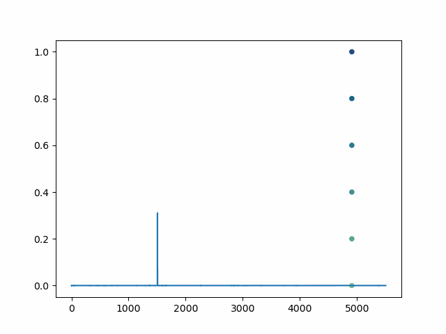

# lottogpt
fork of [nanoGPT](https://github.com/karpathy/nanoGPT) to generate next lottery sequence.



It is best to get started by understanding nanoGPT first by watching [youtube - Andrej Karpathy - Let's build GPT: from scratch, in code, spelled out. ](https://www.youtube.com/watch?v=kCc8FmEb1nY).

## the elephant in the room
Gambling is not encouraged! The lottery is random and the winning sequence CANNOT be predicted. However, we can predict the *probability* of each sequence being the next sequence drawn and that is what is done here. This is an example project that illustrates how one could use an existing technology in a new way by transforming the data into a data model that matches the expected input. At the time of this writing, the author has yet to predict all winning numbers (but 4 out 5 is not bad!).

## data
The data is real lottery data taken from the [Texas Lottery CashFive](https://www.texaslottery.com/export/sites/lottery/Games/Cash_Five/index.html) game. Historical data can be found by clicking on the "Past Results" button on the page. In this example, only the first 3 numbers in each winning sequence are used (this keeps the network reasonably small; explained in more detail later). The data is a nested list of integer values which can be accessed as

```python
from data.data.py import lottery_data
ldat = lottery_data()
```

`data analysis.ipynb` discusses the first step in any machine learning / data science project: data analysis. The distribution of each number in the sequence is exceptionally interesting.

## vocabulary
Each possible winning sequence is treated as a "word" in a large language vocabulary. To convert these sequences into tokens (encode), a dictionary is created in which the key is the sequence and the value is an integer.

For this game, the minimum and maximum values for each number are
- first number : [1, 31]
- second number : [2, 32]
- third number : [3, 33]

and no sequences are repeated. A convenience function `vocabulary_helper3()` creates these sequences and returns a vocabulary dictionary as well as the number of sequences in the dictionary.

```python
vocab, vocab_size = vocabulary_helper3(i_min=1, i_max=31, j_min=2, j_max=32, k_min=3, k_max=33)
```

The size of the vocabulary in this game is 5456 possible winning sequences (this will be the size of the last layer in the network). 

After building the vocabulary, the dictionary is saved using `pickle`. Load the vocabulary dictionary to be used later for encoding and decoding

```python
with open('data/vocab.pkl', 'rb') as fobj_read:
    ENCODER = pickle.load(fobj_read)  # tokenizer, converts sequences (tuples) to integers.
    VOCAB_SIZE = len(ENCODER)
    DECODER = {v:k for k,v in ENCODER.items()}  # vocabulary lookup table
    fobj_read.close()
```

## PyTorch Dataset and Lightning DataModule
The `LottoDataset` and `LottoDataModule` defined in `lotto_data_module.py` are the PyTorch Dataset that takes input winning draws and converts them to tensors for both target and output data and the Lightning DataModule used by the Lightning Trainer.

```python
testing_dataset = LottoDataset(data=ldat, tokenizer=ENCODER, mode='test', block_size=32)
```

## gpt as a LightningModule
The model in `lotto_gpt.py` is a fork of [nanoGPT](https://github.com/karpathy/nanoGPT) modified to be a LightningModule for training.

## training
Run `train_model.py` to 
- load the data
- load the vocabulary, i.e. sequence to integer tokenizer
- the Lightning DataModule, 
- 

## prediction
Load the trained model and extract the last `BLOCK_SIZE` tokens which are passed to the model for prediction. The output is a tensor of probabilites. The index of the largest value corresponds to a particular token which can be *decoded* back to the sequence.
